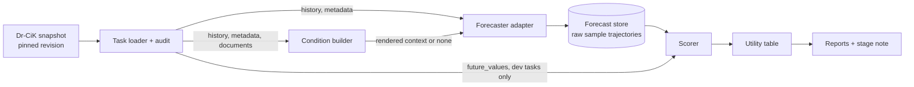

# Evidence-Utility Track: Plan for Stages U0 and U1

Status: draft for Teo's review, revised 2026-09-18. Section 1 was corrected after U0.1 and U0.2 against the loaded data (see `artifacts/u0/data_audit.md`); stages U0.1 to U0.3 are complete and committed, U0.4 onwards has not started.
Companion file: `plan_a_follow_up.md` (provisional outline for U2 to U7; will change after U0, U1 and the supervisor discussion).

---

## 0. How to use this file

This file is written for a coding agent that has no other knowledge of the project. Everything needed for U0 and U1 is stated here or is to be verified from the named repositories. Assume that nothing exists before U0.1: any sentence that reads as if something had already been inspected, measured or verified is a prior to be checked, not a fact.

Rules of work:

1. Work on one substep at a time (U0.1, U0.2, ...). Each substep ends with a **CHECK** and a **STOP**. At a STOP, report what was done and what the check showed, and wait for Teo.
2. Never proceed past a **GATE** without Teo's written confirmation.
3. Section 6 lists **open decisions** (A to J). Do not resolve them yourself. Where a default is given, implement the default in a way that is easy to change (config value, not code). Where a decision is marked *blocking*, stop when you reach it.
4. Prompt text for any LLM call is not written in this file. It is drafted separately, shown to Teo, and approved before any paid call (Decision D).
5. Claims must be verified from code or data, not taken from paper prose or from this file. If something here disagrees with what you find, stop and report the disagreement.
6. No paid API call happens in U0. In U1, no paid call happens before the cost cap (Decision I) is set and the dry-run estimate has been shown to Teo.
7. At the end of each stage, write a stage note using the template in section 10.

---

## 1. Background

### 1.1 The setting

**Context-aided forecasting (CAF):** a forecaster receives a numerical time-series history plus text, and produces a probabilistic forecast of future values. The text can carry information the numbers do not contain, for example that a past spike was a recording error.

**CiK** (Context is Key; Williams et al., ICML 2025, arXiv:2410.18959) is a benchmark where the relevant text is handed to the forecaster directly. Code: `ServiceNow/context-is-key-forecasting` on GitHub.

**Dr-CiK** (Tang et al., 2026, arXiv:2605.27904) removes that assumption. Each task pairs a time series with a corpus of 30 to 74 Markdown documents (median 37; the paper's "about 37 to 40" undersells the spread). Some documents are *supporting* (they contain the evidence needed to forecast well). The rest are *distractors*, exactly five of each of five subtypes: `confounder`, `noisy`, `timeseries`, `profile`, `temporal`. A deep research (DR) agent is supposed to find the supporting evidence, reject the distractors, and pass useful context to a forecaster. The paper reports that agents recover little of the evidence, cite distractors often, and that raw supporting documents passed to a forecaster without synthesis can make forecasts worse than no context.

### 1.2 What Dr-CiK has released (verified in U0.1 and U0.2 against Hugging Face revision `00fbe820`, Dr-CiK commit `4acbafe1`)

Sources: GitHub `ServiceNow/Dr-CiK` (`README.md`, `SUBMISSION.md`, `sample/`), Hugging Face dataset `ServiceNow/Dr-CiK`. Snapshot fingerprint: `data/fingerprint.json`. Full schema and audit: `artifacts/u0/data_audit.md`.

- 279 tasks, 10,342 documents (3,367 supporting, 6,975 distractor). Confirmed by count in U0.1. Licence CC BY 4.0.
- The README states that the paper's figures (240 tasks / 8,849 documents) describe an earlier release. The public release is the 279-task version.
- **Dev set:** 199 tasks, `origin = synthetic`, labels public (`future_values` and `gt_evidence` included). Confirmed.
- **Hidden test set:** 80 tasks, `origin = human`, `future_values` and `gt_evidence` withheld. Filter with the `labels_public` field. These tasks still contain history, `future_timestamps`, documents and metadata. Confirmed. The audit also found, in hidden tasks only: 17 tasks whose last history timestamp equals the first future timestamp, and 13 tasks with NaN values in the history. Forecasters must handle both explicitly.
- Hugging Face configs: `tasks`, `documents`, `task_documents`, each with split `train`, served as one `train.jsonl` file per config.
- **Released schema (flat, three tables joined on `document_id`; the nested layout described in an earlier draft of this file does not exist in the release):**
  - `tasks`: `benchmark_id`, `split`, `origin`, `labels_public`, `reasoning_hops`, `entity_name`, `entity_type`, `profile_id`, `profile_name`, `profile_details`, `time_series_variable`, `frequency`, `prediction_length`, `seasonal_period`, `target_description`, `history_timestamps`, `history_values`, `future_timestamps`, `future_values`, `gt_evidence`, `document_ids`, `raw_task_path`.
  - `documents`: `document_id`, `text`, `roles`, `subtypes`, `task_ids`, `raw_document_path`. Every document carries exactly one role.
  - `task_documents`: `benchmark_id`, `document_id`, `rank`, `role`, `subtype`, `raw_document_path`.
  - Quirk: `seasonal_period` is a string in 165 tasks (for example `"1h"`) and an integer in 114. The loader stores it as `str | int | None`; U0.4 must resolve it to a step count in one shared place for the seasonal-naive forecaster and the A2 scaling.
- The original CiK context fields (`background`, `instruction`, `constraints`, `full_text`) are intentionally excluded from the release.
- Leaderboard: outputs on the 80 hidden tasks are submitted by pull request and scored by the maintainers with a private scorer. Forecast submissions need at least 100 sample trajectories per task. Stated forecast metrics: scaled MAE, scaled RMSE, scaled CRPS, winsorised at 5.0 per task, then mean ± standard error over tasks. Stated DR metrics: evidence recall, supporting-document recall, distractor avoidance.

**Not released:** the agent harness, the scorer, the forecaster prompt template, and the exact definition of the scaling used in the "scaled" metrics. These have to be rebuilt. This file covers the part needed for U0 and U1.

**Confirmed in U0.2, more strongly than expected:** sorting `task_documents` by `rank` places every supporting document before every distractor in all 279 tasks, and within the distractor block the subtypes follow a fixed order (`confounder`, `noisy`, `timeseries`, `profile`, `temporal`, repeated). Stored order therefore reveals both role and subtype. Any code that renders documents into a prompt must shuffle with a recorded seed first (Decision G).

### 1.3 A concrete task, for orientation

Figures recomputed from the loaded data in U0.2.

`task_42` in `sample/tasks/` of the Dr-CiK GitHub repo: daily sales volume of a fictional store, 156 history points, 100-step horizon, 38 documents (13 supporting, 25 distractors). The ground-truth evidence says a software bug inflated recorded sales during 2025-10-12 to 2025-11-03 and will not recur, and that a sales event from 2025-12-21 to 2026-01-28 raised sales slightly before a return to normal. In the data the bug window averages about 834 units per day against about 438 for the rest of the history; the true future averages about 465. A forecaster without context cannot know the 834 level was an artefact.

---

## 2. What this track investigates

**Track question:** which pieces of retrieved context improve a forecast, and can that be estimated before the outcome is known, so that context is passed to the forecaster only when it is expected to help?

**Central quantity, with sign convention:**

> `utility(context) = score(forecast without context) − score(forecast with context)`
>
> The score is a scaled CRPS, where **lower is better**. Therefore **positive utility means the context helped**, negative means it hurt, zero means no effect. Every table, column name and plot must follow this convention and state it.

Utility is a difference between two conditions on the same task, scored the same way. It is therefore much less sensitive to the exact scaling definition than an absolute score is. This is the reason the missing official scorer does not block the track.

U0 and U1 do not answer the track question. They build the measuring instrument and check that it works:

- **U0** builds the data loader, the scorer, the condition builder and the forecast store, and exercises them end to end with zero-cost statistical forecasters. No LLM calls.
- **U1** is an instrument check on about five tasks: does an LLM forecaster improve when given the correct evidence, and does it fail to improve when given irrelevant text? If not, nothing later in the track can be measured.

---

## 3. Experiment architecture

This architecture applies to the whole track. Later stages add new *condition types* and new *forecasters*; they do not add new pipelines.



### 3.1 Components and their contracts

| Component | Input | Output | Contract |
|---|---|---|---|
| **Snapshot** | Hugging Face dataset at a pinned revision | Local parquet/JSON copy plus a fingerprint file | Every run records the revision hash and file checksums. No component reads from the network after the snapshot is taken. |
| **Task loader + audit** | Snapshot | Typed `Task` and `Document` objects; a per-task index table | Validates invariants (section 7, U0.2). Splits each task into a `ForecastInput` (no labels) and a `TaskLabels` object (future values, evidence). |
| **Condition builder** | `ForecastInput`, documents, optionally `gt_evidence`, a seed | A `Condition` record: condition id, rendered context string or `None`, the document ids used, token count, seed | Deterministic given its inputs and seed. Makes no model calls. |
| **Forecaster adapter** | `ForecastInput`, rendered context, number of samples, seed | Array of shape `[n_samples, horizon]` plus call metadata | One interface for statistical and LLM forecasters. Never receives `TaskLabels`. |
| **Forecast store** | Forecaster output | Append-only records keyed by (task, condition, forecaster, repeat) | Stores raw sample trajectories, never only scores. Records are immutable once written. |
| **Scorer** | Forecast store, `TaskLabels` | Per-cell scores under every scaling option | A pure function of stored data. Rerunnable at no cost when a scoring decision changes. |
| **Utility table** | Scores | One row per (task, condition, forecaster, repeat) with utility relative to the no-context condition | Follows the sign convention in section 2. |

### 3.2 Design rules that follow from this

1. **The unit of record is a cell:** one (task, condition, forecaster, repeat). All experiments in the track are sets of cells.
2. **Forecasting and scoring are separated.** Forecasting costs money and is not reproducible exactly. Scoring is free and deterministic. Storing raw trajectories means a change to the scaling, the winsorisation or the CRPS estimator never requires new LLM calls.
3. **Label isolation.** `future_values` must not be reachable from the code path that builds prompts. Enforce this by type (the forecaster adapter's input type has no such field) and by a test (U0.5).
4. **Every cell is traceable.** Each record stores: dataset revision, code commit, config hash, condition seed, forecaster name and version, model identifier, sampling parameters, timestamp, token counts, cost, number of requested and of valid samples.
5. **Failures are data.** An LLM output that cannot be parsed is logged and counted. It is never silently dropped, because if one condition fails more often than another, dropping failures biases the comparison.

### 3.3 Conditions used in U1

| Id | Name | Context given to the forecaster | Purpose |
|---|---|---|---|
| C0 | no-context | none | Reference for utility. |
| C1 | gt-evidence | the task's `gt_evidence` spans | Upper reference: the forecaster receives the correct evidence. |
| C2 | supporting-concat | all supporting documents of the task, concatenated | Reproduces the "raw documents" condition that Dr-CiK reports as harmful. Observed, not gated. |
| C3 | placebo | `gt_evidence` taken from a *different* task | Text of similar form that is irrelevant. Must not help. |
| C4 | all-docs-concat | every document of the task, shuffled, concatenated | Optional, off by default (about 20k tokens per call). |

The placebo check is motivated by Sridhar et al. (arXiv:2608.22321), who found that for a family of text-conditioned forecasters, replacing the text with empty, shuffled or cross-domain text changed error by under 0.5%. A forecaster that behaves that way cannot be used to measure context quality.

---

## 4. Stage map

| Stage | Purpose | LLM cost | Covered in |
|---|---|---|---|
| **U0** | Harness, scorer, condition builder, zero-cost end-to-end run | none | this file |
| **U1** | Instrument check on about 5 tasks | small, capped | this file |
| U2 | Noise floor and per-document utility pilot | small | outline file |
| U3 | Per-document utility table | moderate | outline file |
| U4 | DR agent runs with logged signals | moderate | outline file |
| U5 | Predicting utility before the outcome is known | none (reuses U3/U4) | outline file |
| U6 | Gating context on predicted utility | low | outline file |
| U7 | Hidden-test submission, write-up | low | outline file |

---

## 5. Working conventions

### 5.1 Devices and their state on 2026-09-18

| Device | Role | State |
|---|---|---|
| Personal PC: Windows 11 Pro, PowerShell | Plan authoring, repository scaffold, zero-cost work, reading previews. Never holds provider keys. | `uv`, `git` and the Python launcher are on PATH. Workspace root `C:\Users\pazer\Desktop\RU\m_th_code_2nd\` is the git repository; U0.1 to U0.3 were run here. |
| Company MacBook: macOS, zsh | Most of the implementation and every paid LLM call. | Not set up. Unknown until the first session there: allowed git remotes, proxy, whether Hugging Face downloads work, approved LLM providers (Decisions K, L, C). |

An older folder `C:\Users\pazer\Desktop\RU\master_thesis_code_efforts\` exists beside the workspace, with clones of `Dr-CiK` and `context-is-key-forecasting` and other material from an earlier attempt. It is **not** part of this project: no code, config or document here may read from it or refer to it. The two external repositories are cloned fresh into this workspace (5.3) and pinned to commits recorded in `configs/external_revisions.md`.

### 5.2 One repository, two machines: operating rules

The repository root is `m_th_code_2nd` itself (git-initialised in U0.1). The repository is the only thing that moves between machines, through a git remote (Decision K). Data is re-downloaded on each machine and checked against a committed fingerprint. Nothing is copied by hand.

1. **Toolchain identical on both.** `uv` with `pyproject.toml`, `uv.lock` and `.python-version` committed; one pinned minor version (3.12 unless a dependency forbids it), installed by `uv` on both machines. No system Python, no conda. `uv sync` recreates the environment on either machine.
2. **Entry points are Python, not shell.** One CLI, `uv run utrack <command>`. No Makefile, no `.ps1` or `.sh` scripts in the workflow. Anything a script would do is a `utrack` subcommand and therefore runs the same in PowerShell and zsh.
3. **No absolute paths** in code or committed config. Paths are repo-relative `pathlib.Path` objects resolved from the package location. Everything machine-specific lives in `configs/machines/<name>.yaml` (`windows-pc.yaml`, `macbook.yaml`), selected by the `UTRACK_MACHINE` environment variable. These files hold only cache-directory overrides, network flags, allowed providers and the cost cap. They are committed and contain no secrets.
4. **Secrets only in `.env`** (git-ignored, loaded with `python-dotenv`); `.env.example` committed with empty values. The Windows PC never has provider keys in its `.env`. A test asserts that no string shaped like a key appears under `configs/`, `artifacts/` or in logs.
5. **Text handling.** `.gitattributes` with `* text=auto eol=lf`; `.editorconfig` with LF and UTF-8; every `open()` passes `encoding="utf-8"` (Windows defaults to cp1252). Fingerprints are computed on the parquet bytes of the snapshot, never on text files, so line-ending normalisation cannot change them.
6. **File names** are lowercase ASCII with no character illegal on Windows (`: ? * < > | "`); timestamps inside names use `2026-09-18T10-30-00`. Both default filesystems are case-insensitive, so two paths differing only in case are forbidden.
7. **Determinism across operating systems.** `numpy.random.default_rng(seed)` only; dictionary keys sorted before hashing; no reliance on Python's per-process string `hash()` or on directory listing order (always sort). The condition previews of U0.5 are committed with a SHA-256 list, and a test regenerates them and compares, so the MacBook proves it reproduces the Windows renderings before any paid call.
8. **Data locations.** `data/` holds the snapshot (git-ignored) and `data/fingerprint.json` (committed). `artifacts/` is git-ignored except `*.md`, `*.json` and parquet files under 5 MB that a stage names as deliverables. `HF_HOME` is set from the machine profile so the Hugging Face cache stays inside the repository tree.
9. **Forecast store records** are small in U0 and U1 (U1: 40 requests × 25 samples) and are committed. The U0 baseline store is free and deterministic, so only its scores and reports are committed and the store is regenerated where needed. If a later stage exceeds the size limit, that stage's plan names the transfer channel.
10. **Before any GATE,** `uv run pytest` and `utrack doctor` pass on the machine that ran the stage, and the stage note's machine record lists OS, Python version, `uv` version and commit. The other machine repeats both at its next session and appends its own line.
11. **Which machine runs a substep is not fixed,** with two exceptions: paid calls run only on the MacBook, and the U0.1 scaffold commit is made on the Windows PC so that this plan and the scaffold reach the MacBook together through the remote.

### 5.3 Repository layout (deviate with a stated reason)

```
m_th_code_2nd/                git root
  plan_a.md, plan_a_follow_up.md
  pyproject.toml  uv.lock  .python-version  .gitattributes  .editorconfig  .gitignore  .env.example
  configs/            u0.yaml, u1.yaml, decisions.md, external_revisions.md
    machines/         windows-pc.yaml, macbook.yaml
  external/           Dr-CiK/, context-is-key-forecasting/  (git-ignored clones, pinned, read-only)
  src/utrack/
    cli.py            doctor, data (snapshot, verify), external (sync), run, score, report
    data/             snapshot, schema, loader, audit
    conditions/       base, builders, placebo
    forecasters/      base, naive, seasonal_naive, llm_direct (U1)
    store/            forecast_store, manifest
    scoring/          crps, scaling, aggregate, utility
    reports/
  tests/
  data/               snapshot (git-ignored) + fingerprint.json (committed)
  artifacts/          u0/, u1/ (rule 8 above)
  thesis/notes/       stage notes
```

**Randomness.** Every seeded operation takes its seed from the config. Seeds are stored in the cell record.

**Starting state.** Nothing exists before U0.1: no repository, no environment, no snapshot, no knowledge ledger, no earlier stage. If U0 finds that a fact stated in this file is wrong (for example a task count or the format of `gt_evidence`), correct this file in the same commit and record the change in the stage note. The idea of recovering the withheld CiK context fields by joining Dr-CiK tasks back to CiK is **not** part of U0 or U1.

---

## 6. Open decisions

Record every resolution in `configs/decisions.md` with date and reason.

| Id | Decision | Options | Default | Blocking? |
|---|---|---|---|---|
| **A** | Scaling used for the headline scaled CRPS | A1: divide by (max − min) of the task's future values, the CiK convention (`inverse_mean_forecast_range`). A2: divide by the in-sample mean absolute seasonal-naive error (MASE-style, uses history only). A3: divide by mean absolute history value. | Compute and store all three. Headline choice made by Teo after the U0 report. | Blocks the U1 gate evaluation, not U0. |
| **B** | Utility form | B1: absolute difference of winsorised scaled CRPS. B2: relative, `1 − score_ctx / score_base`. | Store both. Headline B1. Flag cells where either score hit the winsorisation cap, because capped scores hide differences. | No |
| **C** | LLM forecaster model and provider for U1 | To be chosen from what is approved on the company device. Requirements: temperature 1.0 sampling, context window of at least 32k tokens, ideally several samples per request (`n > 1`) so input tokens are billed once. | none | **Blocks U1** |
| **D** | Forecaster prompt template | D1: port the CiK Direct Prompt template (`cik_benchmark/baselines/direct_prompt.py`, `make_prompt`; path and function name to verify in U0.1) with a context slot. D2: a new template. | D1. The final prompt text is shown to Teo and approved before any paid call. Any later change gets a new template version id stored in each cell. | **Blocks U1** |
| **E** | Samples per forecast and repeats per cell in U1 | | 25 samples (the CiK convention) and 2 repeats. The 100-sample requirement applies only to the final hidden-test submission. | No |
| **F** | U1 task set | | `task_42`, `task_49`, `task_52`, `task_200`, `task_204`: five daily commercial-sales tasks selected for relevance to the downstream Zurich monthly GWP case. They cover temporary reporting/promotion effects and persistent business-expansion level shifts. `task_42` remains because it was already used for U1 smoke-test calls. | No |
| **G** | Rendering of contexts | Order and separators for evidence spans and for concatenated documents | Evidence spans in id order, one per line. Documents in seeded shuffled order, separated by a delimiter line carrying only a neutral index, never the role or subtype. | No |
| **H** | Placebo construction | H1: `gt_evidence` from another task. H2: H1 plus a length-matched variant. | H1, source task chosen by a seeded assignment such that entity and variable differ from the target task and no task is its own placebo. | No |
| **I** | U1 cost cap | | none. Indicative figures are in section 8, U1.0. | **Blocks U1** |
| **J** | Whether a second LLM forecaster is included in U1 | | No. One model in U1. A second forecaster family is planned for a later stage. | No |
| **K** | Sync channel between the two machines | K1: private GitHub remote. K2: company git host. K3: `git bundle` files over an approved transfer path. | K1, if company policy allows the MacBook to push to it. | **Blocks the first MacBook session** |
| **L** | Network and providers permitted on the MacBook | Can it clone from GitHub, download from Hugging Face, and which LLM providers are approved? | none; checked at the first MacBook session with `utrack doctor` | **Blocks U0.1 on the MacBook and Decision C** |

---

## 7. Stage U0: harness and scorer (no LLM calls)

**Question:** can Dr-CiK tasks be loaded, turned into conditions, forecast, stored and scored end to end, with a scorer whose behaviour is tested?

### U0.1 Environment, scaffold and snapshot

Do (on the Windows PC first; the MacBook repeats every step except `git init` at its first session):
- `git init` at the workspace root and create the layout of 5.3. Commit `pyproject.toml`, `uv.lock`, `.python-version`, `.gitattributes`, `.editorconfig`, `.gitignore`, `.env.example`, both machine profiles and the `utrack` CLI with a `doctor` command that prints OS, Python, `uv` version, the selected machine profile, whether `.env` exists, whether the `external/` clones match `configs/external_revisions.md`, and whether `data/fingerprint.json` matches the local snapshot.
- Clone `Dr-CiK` and `context-is-key-forecasting` into `external/` and record their commit hashes in `configs/external_revisions.md`. Verify there the file paths named in Decisions D and U0.3.
- Download the three Hugging Face configs at a pinned revision into `data/`. Write `data/fingerprint.json` (revision hash, per-file SHA-256, download date, machine name).
- Push to the remote once Decision K is resolved.

CHECK: `utrack doctor` and `uv run pytest` pass; task count 279; 199 with `labels_public` true and 80 false; document count 10,342 with 3,367 supporting and 6,975 distractor. Report any mismatch. On the MacBook the check additionally requires the fingerprint to match the committed one. **STOP.**

### U0.2 Loader and data audit

Do:
- Define `Task`, `Document`, `ForecastInput`, `TaskLabels`. Inspect the normalised schema and document every field actually present, including how tasks link to documents and whether a `rank` or similar ordering field exists and what it correlates with.
- Validate per task: timestamp and value arrays have equal length; `future_timestamps` length equals `prediction_length`; timestamps strictly increase; the last history timestamp precedes the first future timestamp; no missing or non-finite values (report, do not fix); dev tasks have non-empty `future_values` and `gt_evidence`; hidden tasks have them empty; exactly five distractors per subtype; all referenced documents exist.
- Write `artifacts/u0/task_index.parquet` with one row per task: split, origin, frequency, horizon, history length, document counts by role and subtype, approximate token counts (per document, per role, whole corpus, serialised history), number of evidence spans, future range, history range, and a flag for near-constant futures.
- Write `artifacts/u0/data_audit.md`: the schema as found, all invariant violations, distributions of the index columns, and an answer to: does stored document order reveal role?

CHECK: audit file exists and every violation is listed. **STOP.**

### U0.3 Scorer

Do:
- **CRPS from samples.** Port `crps()` from `cik_benchmark/metrics/crps.py` (path to verify in U0.1; Apache-2.0, keep the licence header and attribution). Its docstring describes it as the probability-weighted-moment form, exact and without estimation bias. Also implement the energy-form fair estimator independently: `mean_i |x_i − y| − (1 / (2 n (n − 1))) Σ_i Σ_j |x_i − x_j|`. CRPS is computed per time step and averaged over the horizon.

  > **Estimator warning.** The same CiK file contains `crps_quantile`, a quantile-loss approximation. Do not use it. Also do not use the common biased estimator with `1 / (2 n²)`: its expected value depends on the number of samples, which would distort any comparison between cells with different valid-sample counts.

- **Scaling** options A1, A2, A3 (Decision A), each returning a per-task positive scalar, each with explicit handling and logging of zero or near-zero denominators.
- **Winsorisation** of the per-task scaled score at 5.0, with a flag column.
- **Aggregation:** mean and standard error over tasks.
- **Utility functions** B1 and B2 with the sign convention of section 2.
- Also compute scaled MAE (of the sample median) and scaled RMSE (of the sample mean), since the leaderboard reports them.

Unit tests (all must pass):
1. A point-mass forecast gives CRPS equal to absolute error.
2. The ported and the independent estimator agree to numerical precision on random inputs. If they do not, stop and report; do not pick one.
3. For Gaussian samples with large n, CRPS converges to the closed-form Gaussian CRPS.
4. Result is invariant to the order of samples.
5. Multiplying series and samples by a constant leaves each scaled score unchanged.
6. Winsorisation caps at 5.0 and sets the flag.
7. On synthetic Gaussian forecasts, the mean fair CRPS is stable across n = 10, 25, 100, while the biased estimator is not. Keep this test as documentation of the estimator choice.
8. Utility sign: a forecast closer to the truth than the reference yields positive utility.
9. If the CiK repository is available, the ported function reproduces the original's output on identical arrays.

CHECK: test report. **STOP.**

### U0.4 Zero-cost forecasters and end-to-end run

Do:
- Implement the forecaster interface and two statistical forecasters that return sample trajectories: last-value naive and seasonal naive (season from `seasonal_period` when usable), with sample paths produced by a documented residual bootstrap. An ETS or ARIMA forecaster is optional.
- Implement the forecast store and manifest per section 3.2.
- Run both forecasters with condition C0 on all 199 dev tasks, 100 samples each. Score under all three scalings.
- Write `artifacts/u0/baseline_scores.parquet` and `artifacts/u0/baseline_report.md`: score distributions per scaling, share of tasks at the winsorisation cap per scaling, the tasks with degenerate denominators, and rank agreement between scalings.

These numbers are later used as the statistical floor. They are not expected to match figures in the Dr-CiK paper, which cover a different task set. If the paper states a no-context naive score, quote it next to yours with that caveat and do not tune anything to match.

CHECK: 199 × 2 cells stored and scored; report written. **STOP.**

### U0.5 Condition builder and U1 preview

Do:
- Implement the `Condition` abstraction and builders for C0 to C3, and C4 behind a config flag, following Decisions G and H.
- Select the U1 task set per Decision F. Write `artifacts/u0/u1_tasks.json` with the selection rule and seed.
- For each U1 task and condition, write the rendered context to `artifacts/u0/conditions_preview/<task>/<condition>.md` with a header giving document ids, token count and seed. Teo reads these before any paid call.
- **Leakage test:** assert that no rendered prompt input for a dev task contains a run of consecutive `future_values` formatted the way history values are formatted, and that the forecaster input type has no field holding labels. Note that `gt_evidence` may legitimately contain numbers and future-dated statements; that is the benchmark's intended context, not leakage. Report any task where evidence text contains the exact future values.

CHECK: preview files exist for every U1 cell; leakage test passes. **STOP.**

### U0.6 Dry-run cost estimate for U1

Do:
- Add a dry-run mode to the (not yet implemented) LLM forecaster path that builds every request for U1 and counts input tokens, without sending anything. Estimate output tokens from horizon length.
- Write `artifacts/u0/u1_cost_estimate.md`: requests, input and output tokens per condition, and cost under two billing assumptions (several samples per request, and one sample per request), with the price per million tokens as a config value for Teo to fill in.

CHECK: estimate written. **STOP.**

### GATE U0

All of the following hold:
1. Snapshot counts match section 1.2 or every mismatch is explained.
2. All scorer unit tests pass.
3. Baseline scores exist for all 199 dev tasks under all scalings.
4. Condition previews and the leakage test are complete.
5. The cost estimate exists.
6. The stage note is written, including evidence relevant to Decisions A and B.
7. `uv run pytest` and `utrack doctor` have passed on both machines, and the MacBook's snapshot fingerprint matches the committed one.

Then tag the commit `u0-gate`, push it (section 9) and stop. Teo resolves Decisions A, C, D and I before U1 starts.

---

## 8. Stage U1: instrument check

**Question:** does the chosen LLM forecaster improve when given the correct evidence, and fail to improve when given irrelevant text of similar form?

This is a sanity check on about five tasks. It supports no statistical claim and must not be reported as a result about context quality.

### U1.0 Preconditions

- Decisions C, D, E and I are resolved in `configs/decisions.md`.
- Teo has read the condition previews.
- Indicative size, to be replaced by the U0.6 estimate: 5 tasks × 4 conditions × 2 repeats = 40 requests of 25 samples each, 1,000 generated trajectories. The token figures that follow are rough prior guesses, not measurements (nothing has been measured yet); U0.6 replaces them: serialised history about 330 to 1,200 tokens, `gt_evidence` a few hundred tokens, supporting documents concatenated about 4,700 to 6,100 tokens, full corpus about 18,000 to 22,000 tokens, output about 8 tokens per forecast step. With several samples per request this is roughly 0.2 million input and 0.6 million output tokens; with one sample per request, input rises about 25-fold.

### U1.1 LLM forecaster adapter

Do:
- Implement the adapter behind the common forecaster interface, using the approved prompt template. Reference for parsing and retry behaviour: CiK `direct_prompt.py` (temperature 1.0, retries on invalid output).
- Validate each returned trajectory: correct length, all values finite, timestamps matching `future_timestamps` when the format includes them.
- Record requested and valid sample counts per cell. Retry up to a configured limit. A cell that ends with fewer valid samples than requested is marked incomplete and reported; its samples are kept.
- Maintain a cost ledger updated after every request. Abort before sending a request whose conservative estimated cost could take the ledger beyond the cap.
- For the selected LiteLLM route, request one trajectory per API call: `n > 1` was tested on 2026-09-18 and rejected by Gemini. The nominal full run is therefore 1,000 API requests plus retries.
- Use Gemini provider-side prompt caching by marking one continuous, byte-identical static prompt block with `cache_control: {"type": "ephemeral"}`. Do not enable LiteLLM response or semantic caching, because replayed completions would invalidate independent forecast samples. Record cached tokens and LiteLLM's per-request cost headers. Implementation details and verified behavior are in `docs/u1_litellm_gemini.md`.

CHECK: adapter passes tests against a mocked client. **STOP.**

### U1.2 Smoke test

Do: `task_42`, conditions C0 and C1, 5 samples, 1 repeat. Plot history, truth and the sample trajectories for both. Compare actual token counts and cost with the dry-run estimate.

**Kill conditions:** valid-sample rate below 80%; cost per request more than twice the estimate; any sign of labels in a prompt.

CHECK: plots and ledger shown to Teo. **STOP.**

### U1.3 Full U1 run

Do: all U1 tasks × enabled conditions × repeats × samples per Decision E. Store every cell.

### U1.4 Scoring and report

Do:
- Score all cells under all scalings. Compute utility against C0 within the same task and repeat.
- **Noise estimate:** for each task and condition, the absolute difference in score between the two repeats. Summarise by the median over tasks and conditions.
- Write `artifacts/u1/u1_report.md`: per task and condition the scores, utilities, valid-sample rates and cap flags; the noise estimate; per-task plots of quantile bands for each condition against the truth; total cost.

### U1.5 Gate evaluation (criteria fixed in advance)

Let *noise* be the median repeat-to-repeat score difference from U1.4, under the headline scaling from Decision A.

| Id | Criterion | Pass condition |
|---|---|---|
| G1 | Responds to correct evidence | utility(C1) > 0 on at least 4 of 5 tasks, and median utility(C1) > noise |
| G2 | Placebo does not help | median utility(C3) ≤ noise, and utility(C3) > noise on at most 1 of 5 tasks |
| G3 | Reads the text | the scaled absolute difference between the C1 and C0 forecast medians exceeds the same quantity between two repeats of C0, on at least 4 of 5 tasks |
| G4 | Operational | valid-sample rate ≥ 95% in every condition; total cost within the cap |

Observed and reported, not gated: utility(C2) relative to C0 and to C1. Dr-CiK reports that raw supporting documents degrade forecasts; record whether that appears here.

If the task count differs from 5, scale "4 of 5" and "1 of 5" to the same proportions and state the thresholds before looking at results.

**What each outcome means:**

| Outcome | Reading | Next action |
|---|---|---|
| All pass | The forecaster can be used to measure context utility. | Proceed to planning U2 with Teo. |
| G1 fails, G3 passes | The forecaster reacts to evidence but not in the helpful direction. | Inspect per task: evidence rendering, prompt wording, whether the evidence is sufficient on its own. Do not change the gate. |
| G1 and G3 fail | The forecaster ignores the text. | Report. A different model (Decision C) is the first option; the track cannot continue with this forecaster. |
| G2 fails | Irrelevant text improves forecasts, so utility would be confounded with a generic effect of added text, for example prompt length. | Add the length-matched placebo (Decision H2) and rerun C3 only. Do not proceed until resolved. |
| G4 fails | Parsing or cost problem. | Fix the adapter or prompt format; rerun the smoke test. |

### GATE U1

G1 to G4 evaluated and reported, stage note written, commit tagged `u1-gate` and pushed (section 9). Stop. Teo decides whether and how U2 proceeds.

---

## 9. Handoffs between machines

The git remote is the channel (Decision K). A handoff is a tagged commit; the only thing that travels outside git is the data snapshot, which each machine downloads itself and checks against the committed fingerprint.

| Handoff | Tag | Committed contents | Outside git |
|---|---|---|---|
| U0 → U1 | `u0-gate` | `configs/decisions.md`; `data/fingerprint.json`; `artifacts/u0/u1_tasks.json`; `artifacts/u0/conditions_preview/` with its SHA-256 list; `artifacts/u0/u1_cost_estimate.md`; stage note | The snapshot: the MacBook runs `utrack data snapshot` then `utrack data verify`, and nothing else runs until the fingerprint matches. |
| U1 → review | `u1-gate` | forecast store records for U1; run manifest; cost ledger; `artifacts/u1/u1_report.md`; plots; stage note | nothing |

No credentials or provider keys appear in any commit, config, artifact or log. If Decision K rules out a remote, the same contents move as `git bundle` files through the approved transfer path; the tags and the fingerprint check stay the same.

---

## 10. Stage note template

One note per stage at `thesis/notes/NN-slug.md`, using the next free number. Slugs: `u0-harness-scorer`, `u1-instrument-check`. Notes are plain Markdown with Mermaid where useful; no Obsidian vault exists yet. If the notes are later moved into one, wikilinks and MathJax become available, but nothing in a note may depend on that.

```
# NN — <stage id>: <title>
Machine record       (machine profile, OS, Python, uv version, commit; one line per machine that ran part of the stage)
Question
What I did
Findings            (each with the file or test that supports it)
Open questions
Implications for the thesis
Gate result         (each criterion: pass / fail / not evaluated, with evidence)
Corrections to this plan   (facts in plan_a.md that turned out wrong, and the commit that fixed them)
```

---

## 11. Out of scope for U0 and U1

- Any DR agent, retrieval, or DR-quality metric (evidence recall, supporting-document recall, distractor avoidance). Their definitions are left to the stage that first runs an agent.
- Per-document utility measurement.
- The hidden test set, beyond loading and auditing it.
- A second LLM forecaster.
- Any internal company data.
- Tuning prompts or models to improve scores. U1 checks an instrument; it does not optimise one.